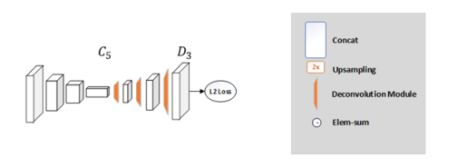

[中文README]|[README_EN.md](README_EN.md)
# Simple Baselines for Human Pose Estimation and Tracking


## 1 简介
  
本项目基于paddlepaddle框架复现了Simple Baseline人体姿态估计算法，基于Pose_ResNet50在MPII据集上进行了实验。
项目提供预训练模型和AiStudio在线体验NoteBook。
**论文：**
- [1] Xiao, Bin and Wu, Haiping and Wei, Yichen.
European Conference on Computer Vision (ECCV), 2018. [Simple Baselines for Human Pose Estimation and Tracking](https://arxiv.org/abs/1804.06208)

**项目参考：**
- [https://github.com/microsoft/human-pose-estimation.pytorch](https://github.com/microsoft/human-pose-estimation.pytorch)

## 2 复现精度
>在MPII val数据集的测试效果如下表。

|NetWork |epochs|opt|image_size|batch_size|dataset|memory|card|mean|config|weight|log|
| :---: | :---: | :---: | :---: | :---: | :---: | :---: | :---: | :---: | :---: | :---: | :---: |
|PoseResNet50|140|SGD|256x256|32x4|MPII|32G|1|88.7|[256x256_d256x3_adam_lr1e-3.yaml](experiments/mpii/resnet50/256x256_d256x3_adam_lr1e-3.yaml)|(链接: https://pan.baidu.com/s/13bG-VGyW4VsD5iw3aJpJsQ 提取码: d3qy 复制这段内容后打开百度网盘手机App，操作更方便哦)|[log](deeplabv2_res101_voc_0.125_20k/train.log)|

注意：与原项目一致，采用了Flip test。原项目的配置是4卡，所以batch_size需要在[原始项目的实验设置](https://github.com/microsoft/human-pose-estimation.pytorch/tree/master/experiments) 基础上x4。

## 3 数据集
[MPII](http://human-pose.mpi-inf.mpg.de/)
原始数据集是matlab的格式，论文提供了转换成json存储的数据集：[OneDrive](https://onedrive.live.com/?cid=56b9f9c97f261712&id=56B9F9C97F261712%2110692&ithint=folder&authkey=!AKqtqKs162Z5W7g)
- 数据集大小:
    - 训练集: 15K
    - 验证集: 3K
    - 测试集: 7K 
    
16类标注： (0 - r ankle, 1 - r knee, 2 - r hip, 3 - l hip, 4 - l knee, 5 - l ankle, 6 - pelvis, 7 - thorax, 8 - upper neck, 9 - head top, 10 - r wrist, 11 - r elbow, 12 - r shoulder, 13 - l shoulder, 14 - l elbow, 15 - l wris

应有的数据集结构：
```
|-- data
`-- |-- mpii
    `-- |-- annot
        |   |-- gt_valid.mat
        |   |-- test.json
        |   |-- train.json
        |   |-- trainval.json
        |   `-- valid.json
        `-- images
            |-- 000001163.jpg
            |-- 000003072.jpg
```

## 4 环境依赖
- 硬件: Tesla V100 16G * 1

- 框架:
    - PaddlePaddle == 2.2.2
  
    
## 快速开始

### 第一步：克隆本项目
```bash
# clone this repo
git clone git@github.com:CuberrChen/HumanPoseBL-Paddle.git
cd HumanPoseBL-Paddle
```

**安装第三方库**
```bash
pip install -r requirements.txt
```

**安装cocoapi**
```bash
cd cocoapi/PythonAPI&&python3 setup.py install --user
```

### 第二步：训练模型
单卡训练：
```bash
python pose_estimation/train.py \
    --cfg experiments/mpii/resnet50/256x256_d256x3_adam_lr1e-3.yaml
```
训练过程中输出的信息类似下面的形式:
```
2021-12-14 09:45:59     Epoch: [61][0/695]      Time 1.030s (1.030s)    Speed 31.1 samples/s    Data 0.819s (0.819s)    Lr 0.0010 (0.0010)      Loss 0.00045 (0.00045)  Accuracy 0.851 (0.851)
2021-12-14 09:46:49     Epoch: [61][50/695]     Time 1.268s (0.992s)    Speed 25.2 samples/s    Data 1.026s (0.800s)    Lr 0.0010 (0.0010)      Loss 0.00044 (0.00047)  Accuracy 0.878 (0.849)
```

多卡训练：
```bash
python -m paddle.distributed.launch --cfg experiments/mpii/resnet50/256x256_d256x3_adam_lr1e-3.yaml
```

注意：
1.可以在配置文件（.yaml）开启DEBUG，输出训练过程中的可视化结果; 
2.可以在配置文件中FLIP_TEST: True开启训练时翻转测试。

### 第三步：测试

```bash
python pose_estimation/valid.py \
    --cfg experiments/mpii/resnet50/256x256_d256x3_adam_lr1e-3.yaml \
    --flip-test \
    --model-file output/mpii/pose_resnet_50/256x256_d256x3_adam_lr1e-3/model_best.pdparams
```

验证输出信息类似下面的形式：
```
Test: [0/93]    Time 0.774 (0.774)      Loss 0.0004 (0.0004)    Accuracy 0.909 (0.909)
Test: [50/93]   Time 1.108 (0.790)      Loss 0.0005 (0.0005)    Accuracy 0.837 (0.852)
| Arch | Head | Shoulder | Elbow | Wrist | Hip | Knee | Ankle | Mean | Mean@0.1 |
|---|---|---|---|---|---|---|---|---|---|
| 256x256_pose_resnet_50_d256d256d256 | 94.884 | 92.646 | 82.990 | 76.239 | 83.815 | 76.224 | 70.382 | 83.302 | 27.263 |
```
### 第四步：单张图像推理
注意: 
**首先需要获得图像中人的检测框. 可以在infer.py 138行处修改.**

如果图像中存在多人，应首先使用检测器，如Faster R-CNN、SSD或其他检测器来检测这些人的位置。因为人体姿势估计的简单基线是一种自上而下的方法。

这里提供了一个测试样例：
```bash
python pose_estimation/infer.py --cfg experiments/mpii/resnet50/256x256_d256x3_adam_lr1e-3.yaml --img-file images/test.jpg  --model-file output/mpii/pose_resnet_50/256x256_d256x3_adam_lr1e-3/model_best.pdparams --flip-test
```
注意：可以通过--flip-test开启翻转测试。具体的可以查看infer的参数输入help。

测试样本图像(280x380)：


### 小数据集训练验证

仓库内的data文件夹下存放了提取的包含8张训练图像和8张验证图像的mpii mini数据集。
（不包含完整数据集标注和图像，只是为了验证本项目的训练和验证的正确性，在后续训练时请替换整个数据集。）
在根据上述说明安装好依赖后，可以直接采用如下命令进行超快速训练和验证：

1. 解压mini数据集
```bash
unzip data/mpii.zip -d data/
```
2. 快速训练验证

```bash
python pose_estimation/train.py \
    --cfg experiments/mpii/resnet50/256x256_d256x3_adam_lr1e-3.yaml --batch_size 2
```
输出信息类似下面：
```
=> load 15 samples
=> load 8 samples
2021-12-14 21:15:25     Epoch: [0][0/8] Time 1.835s (1.835s)    Speed 1.1 samples/s     Data 0.073s (0.073s)    Lr 0.0010 (0.0010)      Loss 0.55474 (0.55474)  Accuracy 0.000 (0.000)
Test: [0/1]     Time 1.839 (1.839)      Loss 0.0195 (0.0195)    Accuracy 0.023 (0.023)
| Arch | Head | Shoulder | Elbow | Wrist | Hip | Knee | Ankle | Mean | Mean@0.1 |
|---|---|---|---|---|---|---|---|---|---|
| 256x256_pose_resnet_50_d256d256d256 | 0.000 | 6.250 | 0.000 | 6.250 | 0.000 | 0.000 | 0.000 | 1.852 | 0.000 |
=> saving checkpoint to output/mpii/pose_resnet_50/256x256_d256x3_adam_lr1e-3

```

### 补充步骤：模型导出为ONXX格式

指定配置文件和预训练模型文件即可。
```bash
python pose_estimation/export.py \
    --cfg experiments/mpii/resnet50/256x256_d256x3_adam_lr1e-3.yaml \
    --model-file output/mpii/pose_resnet_50/256x256_d256x3_adam_lr1e-3/model_best.pdparams
```
导出信息输出类似如下所示:
```
2021-12-14 09:57:14 [INFO]      ONNX model saved in ./output/onnx/posenet.onnx
=> Model saved as: ./output/onnx/posenet.onnx
=> Done.
```
### 补充步骤：利用导出的ONXX模型推理
注意：这个导出模型的deploy脚本，作为一个简单的样例，目前只支持COCO数据集训练的模型。
如果想支持其他数据集训练的模型，需要修改deploy.py中的关节点数目和它们之间的连接关系（67-90行）
```bash
python pose_estimation/deploy.py --img data/coco/images/xxx.jpg --model output/onnx/posenet.onnx --type ONNX --width 656 --height 384
```

## 5 代码结构与说明
**代码结构**
```
   ${POSE_ROOT}
   ├── cocoapi
   ├── data
   ├── experiments
   ├── images
   ├── lib
   ├── log
   ├── models
   ├── output
   ├── pose_estimation
   ├── README.md
   ├── README_EN.md
   └── requirements.txt
```
**说明**
1、本项目在Aistudio平台进行开发，使用Tesla V100 16G* 1。  

2、如果你想使用其他数据集，如coco。请检查[原始项目的实验设置](https://github.com/microsoft/human-pose-estimation.pytorch/tree/master/experiments)

.yaml文件的差异如下(**只需要增加BACKBONE这一行和DEPTH这一行**,其余的相同):
```
MODEL:
  NAME: pose_resnet
  BACKBONE: resnet
  DEPTH: 50
```
3、output目录下包含已经训练好的模型参数（仓库内没有，需要从上面表格提供的链接先下载）以及对应的日志（train.log）。log文件夹包含可视化日志（vdlrecords.1638194689.log）文件。

## 6 模型信息

相关信息:

| 信息 | 描述 |
| --- | --- |
| 作者 | xbchen|
| 日期 | 2021年12月 |
| 框架版本 | PaddlePaddle==2.2.1 |
| 应用场景 | 人体姿态估计 |
| 硬件支持 | GPU、CPU |
| 在线体验 | [Notebook](https://aistudio.baidu.com/aistudio/projectdetail/3232783?contributionType=1)|

## 7 引用

```
@inproceedings{xiao2018simple,
    author={Xiao, Bin and Wu, Haiping and Wei, Yichen},
    title={Simple Baselines for Human Pose Estimation and Tracking},
    booktitle = {European Conference on Computer Vision (ECCV)},
    year = {2018}
}
```